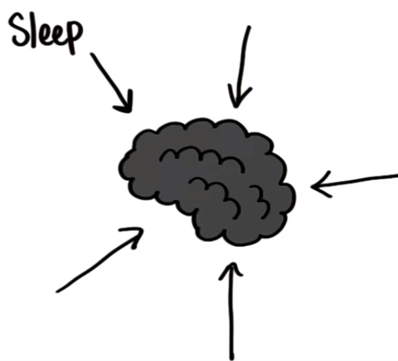

# Intro to Research Methodology

## Constructs

### Construct

A construct is anything that is difficult to measure because it can be defined and measured in many different ways.

**Examples**:

* Intelligence
* Effort
* Age
* Hunger
* Itchiness

### Operational Definition

The operational definition of a construct is the unit of measurement we are using for the construct. Once we operationally define something it is no longer a construct. It is a way of **turning constructs** into variables we can measure.

**Examples**:

Construct     | Operational Definition  
---           |         ---
Depression    | Score on Beck's Depression Inventory
Hunger        | Grams of food consumed
Stress        | Levels of cortisol (the stress hormone)
Anger         | Number of profanities uttered per min
Happiness     | Ratio of minutes spent smiling to minutes not smiling
Health        | Resting heart rate
Obesity       | Body mass index
Effort        | Minutes spent studying on studying for exam
Brand Loyalty | Number of products purchased per year from a particular brands

**Note:** Once we have an operational definition, we are able to measure constructs in the real world

## Data

* Data is most essential part of statistics.
* In **spreadsheet** every **row** represent a different **entity** of same type and each **column** represents as **variables** or **properties** of each row

### Variable Types

* The **relationships** between variables are called hypothesis

#### Extraneous Factors (Lurking Variables)

* These are things that can **impact** the outcome that we may not have thought about. These extraneous factors can impact the outcome, in this case, our memory. Extraneous Factors are also called as **Lurking Variables**

* It's really **difficult** to account for every possible extraneous factors.

* Below is the **definition** of Lurking Variable
  * Lurking Variable provide possible **alternatives explanations** for observed **relationships** between **variables**
  
  * These are the factors that could **influence** the relationships we **measure** between two or more **variables**

  * Should be **controlled** in an **experiment** before we can make **confident causal statements**

  * Make it difficult to make **causal statements** from data from **observational studies**

**Examples**:

* Type of a day you took the test
* Your stress level
* did every one took 5-min breaks
* Age of all participant
* Not paying attention

## Population

In statistics, population refers to the total set of observations that can be made. For example, Every one who took the BBC Face Memory Test is the population.

### Population Parameter

The average memory score of the population is called **Population Parameter** and denoted by **µ** (mu)

## Sample

**We** are the sample who took the BBC Face  Memory Test in Bertelsmann Scholarship 2019. Bigger sample will better approximate the population parameter

## Sample Size

* **Sample size** measures the number of individual **samples** measured or observations used in a survey or experiment.

* Sample size is denoted by **n**.

### Sample Statistics or Sample Average

* The average of sample is called sample statistics and we generally denoted by **x̄** or **X-bar**

* We can use this sample statistics to approximate the population parameter. But generally, they won't be exactly the same.

#### Sample Average Question

|           |           |     |
|   -       |   -       |  -  |
| **100%**  |  82%      | 54% |
|  **98%**  |  **93%**  | 74% |
|  32%      |  61%      | 48% |

**Note**:

* **Bigger** the **sample size** will better approximate the **population parameter**
* The sample statistics can give us an interval in which the population parameter lies, as long as sample is **random** and **unbiased**

### Sampling Error

The difference between Population Parameter and Sample Statistics  ( **µ-x̄** ) called the sampling error. Which means we can make educates guesses about population parameter using **Sample Statistics** but we probably won't be _100%_ accurate. That is why it is really important to have a good sample that can better predict the population parameter

## Randomness

> Perhaps the best typical example that we can give of the scientific meaning of random distribution is afforded by the arrangement of the **drops of rain** in a **shower**. No one acn give a guess whereabouts at any instant a **drop** will fall, but we know that if we put out a sheet of paper it will gradually become uniformly spotted over; and that if we were to mark out any two equal areas on the paper these would gradually tend to be struck equally often. - John Venn 1888

Therefore, when we have a **random sample**, each subject has equal chance of being selected. And then our sample is more likely to **approximate** the **population**.

## Visualize Relationship with Scatter Plot

* Scatter Plot **visualize** the data in the **table**.
* Each **point** represents one **row** of the table.
* We call the variable on the X axis the **Independent Variable** or the **Predictor variable**
* We call the variable on Y axis the **Dependent Variable**, or the **Outcome**.
* In above example wwe are trying to predict temporal memory score, using hours slept.

**Question:** What can we say about the relationship between hours slept and temporary memory score?

**Answer:** _In General_ the more sleep, the better your temporal memory score. This isn't say though that sleep **causes** a higher temporal memory score. This is just a **trend** that we can see from this data. We don't really know if a higher temporal memory score **translates** to better test result.

**Note:** Correlation does not prove **_causation_**. Because there might be **lurking variables** or **extraneous factors** that can also influence the result.

## Casual Inference

* **Show Relationship** &rarr; **Observational Studies Surveys**
If we want to show **relationships** only as with **scatter plots**, we can do **observational studies** where we just take **note** of already existing data or we can do surveys where people are the main subjects and we ask them questions that we are interested in knowing the answers to

* **Show Causation** &rarr; **Controlled Experiment**
If we want to show causation that one particular variable causes another then we'd have to a controlled experiment.

## Surveys

Surveys are used in social and behavioral science.

**Question**: What are some benefits of using surveys to conduct research?

* Easy way to get **info** on a **population**
* Relatively **inexpensive**
* Conducted **remotely**
* Anyone can **access** and **analyze** surveys results

**Question**: What are some downsides to surveys?

* Untruthful responses
* Biased responses
* Respondents not understanding the questions &rarr; (when respondents does not understand the question, we get what's called **Response Bias**)
* Respondents refusing to answer &rarr; (When certain people refuse to answer, this is called **Non-Response Bias**)

**Note**:

* Surveys are often used to analyze **constructs**
* A **good sample size**, a **representative sample** and a **sound methodology** all are really important in good search study.

## Controlled Experiments

* **Controlled experiments** are another important type of research
* Suppose researcher are testing the effects of some sleep medication on bunch of different people and that these people are _random sample_.
* Everyone receives a pill, but for some, the pill has medication and supposedly helps you sleep, and for some others it's inactive.
* The pill looks same for everybody and sample is randomly assigned to one of the two types of pills

**Question1:** What is the purpose of the inactive pill?
**Answer1:** To have a comparison group to those who took the active pill

**Question1:** Why are participants are not told which pill they received?
**Answer1:** To make them all believe they are receiving medication. This prevents participants from being biased concerning the effectiveness of the drug. If they all believe that they are taking the medication, then we are controlling for the bias.

**Note:** Not letting the participants know which treatment they received is called **_blinding_**. Researcher use these techniques when they suspect that knowing which treatment you're receiving might influence your behavior.

## Placebo

* The inactive pill in this called a **_placebo_**. Placebos are fake treatments so that the control group is unaware that they are being treated differently.
* treated differently means thy are not receiving medication.
Placebo = **Inactive pills** means any think opposite for what ex

### Placebo Effect

* People who are taking placebo, might subconsciously think that placebo's not doing anything. And this will influence the results when they report how well they slept

## Double Blind

**Question1:** Should researchers observing quality of sleep know which treatment participants received
**Answer1:** In this case if researchers do not know which treatment the participants received. This called a _**double blind**_ experiment, because neither the participants nor the researchers studying them know which treatment they received.

**Note:** Single blind is when only the participants are unaware of their treatment.

## Controlled Factors

**Question1:** What factors this experiment control for?
**Answer1**:

* Time at which participants took the pill
* The place at which participants slept
* What the pill look likes.

## Random Assignment

* Random Assignment means that everyone has the chance of being assigned to either of the **treatments**.
* In theory, **randomization** makes two groups **similar**.
* Randomization works best with larger groups.

**Question1:** If we did two memory tests on each person - one after sleeping a little, the other after sleeping a lot - and compared the results, what would we be controlling for?

**Answer**:

* Variation in people's individual memory capabilities &rarr; This is called **within-subject** design.

## Conclusion

In this course we have studied below topics

* **Observational Studies** &rarr; Scatter Plot
* **Surveys** &rarr; Ask peoples questions
* **Experiments**  &rarr; Sleep  &rarr; Causality &rarr; Memory

**Note**: We focus on **Observational Studies**.
