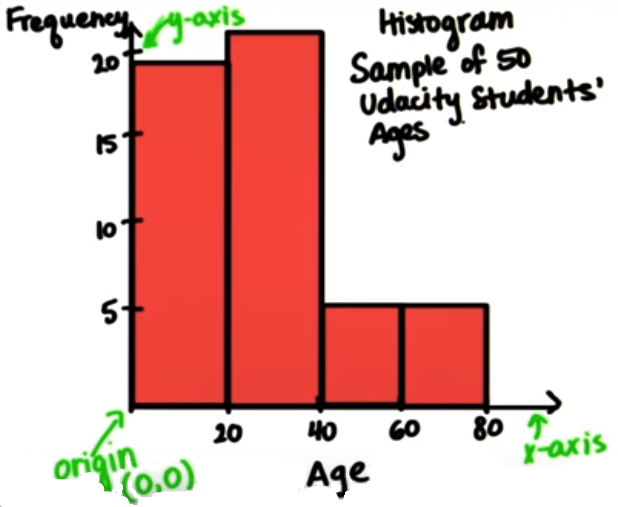

# Visualizing Data

## Table

* A **table** is an arrangement of data in rows and columns, or possibly in a more complex structure.
* Tables are widely used in **research**, and **data analysis**.

**Note:** Just having a table, it's difficult to make quick **conclusion**.

## Frequency Table

To resolve the difficulty we have faced in table scenario, we will create **Frequency Table**

 Country  | Frequency |
 -------- | --------- |
 Canada   |     2     |
 China    |    12     |
 England  |     2     |
 Germany  |     3     |
 India    |     8     |
 Japan    |     8     |
 Mexico   |     3     |
 Pakistan |     1     |
 Sweden   |     1     |
 US       |    10     |

### Frequency

* The frequency of a data set is the number of times a certain outcome("**Country**") occurs.

### Relative Frequency (Proportion)

**Definition:** A proportion is the fraction of counts over the total sample.
A proportion can be turned into a percentage by multiplying the proportion by 100.

We might want to know proportion of students from each country, how many students from each country make up the whole.

**Example:** Using our table from above we can see the proportion of students from china is equal to 12/50 = 0.24.

Country   | Frequency | Relative Frequency
--------- |---------- |-------------------
 Canada   |     2     |        0.04
 China    |    12     |        0.24
 England  |     2     |        0.04
 Germany  |     3     |        0.06
 India    |     8     |        0.16
 Japan    |     8     |        0.16
 Mexico   |     3     |        0.06
 Pakistan |     1     |        0.02
 Sweden   |     1     |        0.02
 US       |    10     |        0.20

**Range of Proportions:**

* All proportions are **greater** than `0` and **less** than `1` or may be equal to either of these values.

**Sum Relative Frequencies:**

* For any frequency table, the relative frequencies should add **1**

**Convert to percentage:**

| Country   | Frequency |  Relative Frequency | Percent
| :-----:   | :-------: |  :----------------: | :-----:
| Canada    |     2     |         0.04        |    4%
| China     |    12     |         0.24        |   24%
| England   |     2     |         0.04        |    4%
| Germany   |     3     |         0.06        |    6%
| India     |     8     |         0.16        |   16%
| Japan     |     8     |         0.16        |   16%
| Mexico    |     3     |         0.06        |    6%
| Pakistan  |     1     |         0.02        |    2%
| Sweden    |     1     |         0.02        |    2%
| US        |    10     |         0.20        |   20%
| **Total** |    **50** |         **1**       |**100%**

**Range Percentages:**

* When we use percentages to measure relative frequency, the range from `0%` to `100%`

* All percentage add to `100`

**Continent:**

* From above table we can conclude frequency and relative frequency for below **continents**

| Continent     | Frequency | Rel. Freq |
| :-------:     | :-------: | :-------: |
| North America |    15     |    30%    |
| Asia          |    29     |    58%    |
| Europe        |    06     |    12%    |

Now we have more **simplified** data and this gave us **fewer** categories to look at. but we **lost** information in the process. Information about different **countries**.

When creating **frequency distribution tables**, there can be sometimes a trade off between **convenience** and **informativeness**. But there is no one right way of presenting the data.  

The **key** is to know how you are going to organize your data, based on the questions that you want to answer.

## Interval OR Bin OR Bucket

**Sample Size** (n)=50

* We can choose an **Interval** for each row as shown in below table, where _0-19_, _20-39_, ... etc are the **intervals** or **bin** or **bucket**.

* In below table the bin **size** for each frequency is `20`

## Histogram

**Histogram**. is a graphical representation of the distribution of data, discrete intervals (bins) are decided upon to form widths for our boxes.

**Question:** Draw a histogram for above grouped frequency distribution table

**Note:**

* **Frequency** are always on the _y-axis_ and **variable** is on _x-axis_

* At the **Intersection** of the axes is the **origin**. It's **Cartesian** coordinates are `0,0`

* From previous lesson if you recall, sometimes the independent variable is also called the **predictor** variable. And the dependent variable, which is on the y-axis, is also called the **outcome**. **But** not in this case.

### Bin Size

We can create a histogram with any bin **size**, or also called the **interval** size. So, it's really up to decide what bin size you want, and it all depends on what **questions** you want to answer. How much detail you want.

**Note:** Bin size is the **interval** in which you're counting the frequency.

### Find Bin Size 17 - 27 Later note karna hay