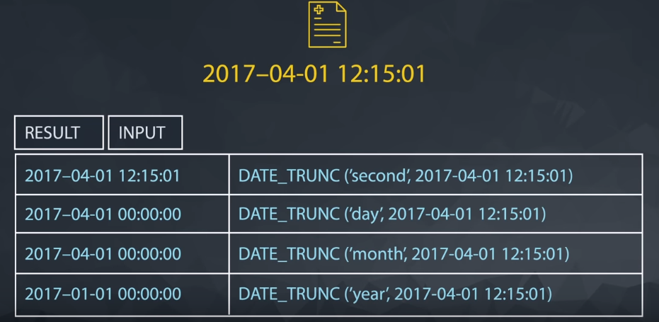

# Aggregators

## Database Null Datatype

**NULLs** are a datatype that specifies where no data exists in SQL. They are often ignored in our aggregation functions, which you will get a first look at in the next concept using **COUNT**.

Notice that **NULL**s are different than a zero - they are cells where data does not exist.

When identifying **NULL**s in a **WHERE** clause, we write **IS NULL** or **IS NOT NULL**. We don't use `=`, because **NULL** isn't considered a value in SQL. Rather, it is a property of the data.

### NULLs - Expert Tip

There are two common ways in which you are likely to encounter **NULL**s:

* **NULL**s frequently occur when performing a **LEFT** or **RIGHT JOIN**. You saw in the last lesson - when some rows in the left table of a left join are not matched with rows in the right table, those rows will contain some **NULL** values in the result set.

* **NULL**s can also occur from simply missing data in our database.

## COUNT the Number of Rows in a Table

Here is an example of finding all the rows in the accounts table.

``` SQL
SELECT COUNT(*)
FROM accounts;
```

But we could have just as easily chosen a column to drop into the aggregation function:

``` SQL
SELECT COUNT(accounts.id)
FROM accounts;
```

**Note**:

* **COUNT** function can also be used to count the number of non-null record in an individual column.

* If the **COUNT** result of a matches the number oof of **ROWS** in a table, there are no **NULL**s in the column.

* We can use Count on any column in a table.

## Sum

Unlike **COUNT**, you can only use **SUM** on numeric columns. However, **SUM** will ignore **NULL** values, as do the other aggregation functions.

**Reminder**:

An important thing to remember: a**aggregators only aggregate vertically - the values of a column**. If you want to perform a calculation across rows, you would do this with simple arithmetic.

**Note**:

* You cannot use `SUM(*)` the way you use `COUNT(*)`

* **SUM** is only for columns that have **quantitative data**. COUNT works on any column.76yyyyyyyyyy

* **SUM** treat **NULL**s as **0**.

### SUM Questions

1. Find the total amount of poster_qty paper ordered in the orders table.
`SELECT SUM(poster_qty) AS total_poster_sales
FROM orders;`

2. Find the total amount of standard_qty paper ordered in the orders table.
`SELECT SUM(standard_qty) AS total_standard_sales
FROM orders;`

3. Find the total dollar amount of sales using the total_amt_usd in the orders table.
`SELECT SUM(total_amt_usd) AS total_dollar_sales
FROM orders;`

4. Find the total amount spent on standard_amt_usd and gloss_amt_usd paper for each order in the orders table. This should give a dollar amount for each order in the table.
`SELECT standard_amt_usd + gloss_amt_usd AS total_standard_gloss
FROM orders;`

5. Find the standard_amt_usd per unit of standard_qty paper. Your solution should use both an aggregation and a mathematical operator.
`SELECT SUM(standard_amt_usd)/SUM(standard_qty) AS standard_price_per_unit
FROM orders;`

## MIN and MAX

* **MIN** and **MAX** are aggregators that again ignore **NULL** values.

* Functionally, **MIN** and **MAX** are similar to **COUNT** in that they can be used on non-numerical columns.

* **MIN** will return the lowest number, earliest date, or non-numerical value as early in the alphabet as possible.

* **MAX** does the opposite—it returns the highest number, the latest date, or the non-numerical value closest alphabetically to “Z.”

## AVG

* Similar to other software **AVG** returns the mean of the data - that is the sum of all of the values in the column divided by the number of values in a column. This aggregate function again ignores the **NULL** values in both the **numerator** and the **denominator**.

### Note: MEDIAN - Expert Tip

One quick note that a median might be a more appropriate measure of center for this data, but finding the median happens to be a pretty difficult thing to get using SQL alone — so difficult that finding a median is occasionally asked as an interview question.

### MIN,MAX and AVG Questions

* Find the mean (**AVERAGE**) amount spent per order on each paper type, as well as the mean amount of each paper type purchased per order. Your final answer should have 6 values - one for each paper type for the average number of sales, as well as the average amount.
`SELECT AVG(standard_qty) mean_standard, AVG(gloss_qty) mean_gloss, AVG(poster_qty) mean_poster, AVG(standard_amt_usd) mean_standard_usd, AVG(gloss_amt_usd) mean_gloss_usd, AVG(poster_amt_usd) mean_poster_usd FROM orders;`

* Via the video, you might be interested in how to calculate the MEDIAN. Though this is more advanced than what we have covered so far try finding - what is the MEDIAN **total_usd** spent on all orders? Note, this is more advanced than the topics we have covered thus far to build a general solution, but we can hard code a solution in the following way.
  
  * `SELECT * FROM (SELECT total_amt_usd FROM orders ORDER BY total_amt_usd LIMIT 3457) AS Table1 ORDER BY total_amt_usd DESC
LIMIT 2; -- UDACITY Solution`

  * `SELECT SUM(Table2."Total_Amount")/2 AS "MEDIAN_Total_USD"FROM (SELECT Table1.total_amt_usd "Total_Amount" FROM (SELECT total_amt_usd FROM orders ORDER BY total_amt_usd LIMIT 3457) AS Table1 ORDER BY Table1.total_amt_usd DESC LIMIT 2) AS Table2; -- Little Change in UDACITY Solution.`

## GROUP BY Clause

 The **GROUP BY** clause is used in the SELECT statement .Optionally it is used in **conjunction** with **aggregate** functions to produce **summary** reports from the database.

* **GROUP BY** allows creating segments that will aggregate independent from one other.

* **GROUP BY** can be used to aggregate data within subsets of the data. For example, grouping for different accounts, different regions, or different sales representatives.

* Any column in the **SELECT** statement that is not within an aggregator must be in the **GROUP BY** clause.

* The **GROUP BY** always goes between **WHERE** and **ORDER BY**.

### GROUP BY - Expert Tip

* Before we dive deeper into aggregations using **GROUP BY** statements, it is worth noting that SQL evaluates the aggregations before the **LIMIT** clause. If you don’t group by any columns, you’ll get a 1-row result—no problem there. If you group by a column with enough unique values that it exceeds the **LIMIT** number, the aggregates will be calculated, and then some rows will simply be omitted from the results.

* This is actually a nice way to do things because you know you’re going to get the correct aggregates. If SQL cuts the table down to 100 rows, then performed the aggregations, your results would be substantially different. The above query’s results exceed 100 rows, so it’s a perfect example. In the next concept, use the SQL environment to try removing the **LIMIT** and running it again to see what changes.

### Group By Questions

1. Which **account** (by name) placed the earliest order? Your solution should have the **account name** and the **date** of the order.
`SELECT a.name, o.occurred_at
FROM accounts a
JOIN orders o
ON a.id = o.account_id
ORDER BY occurred_at
LIMIT 1;`

2. Find the total sales in **usd** for each account. You should include two columns - the total sales for each company's orders in **usd** and the company **name**.
`SELECT a.name "Company Name", SUM(o.total_amt_usd) "Total sales" FROM accounts a JOIN orders o ON a.id = o.account_id GROUP BY (a.name) ORDER BY a.name`

3. Via what channel did the most recent (latest) **web_event** occur, which **account** was associated with this **web_event**? Your query should return only three values - the **date**, **channel**, and **account name**.
`SELECT w.occurred_at "Date", w.channel "Channel", a.name FROM web_events w JOIN accounts a ON a.id = w.account_id order by w.occurred_at DESC LIMIT 1`

4. Find the total number of times each type of **channel** from the **web_events** was used. Your final table should have two columns - the **channel** and the number of times the channel was used.
`SELECT w.channel "Channel", COUNT(w.channel) FROM web_events w GROUP BY (w.channel);`

5. Who was the **primary contact** associated with the earliest **web_event**?
`SELECT a.primary_poc
FROM web_events w
JOIN accounts a
ON a.id = w.account_id
ORDER BY w.occurred_at
LIMIT 1;`

6. What was the smallest order placed by each **account** in terms of **total usd**. Provide only two columns - the account **name** and the **total usd**. Order from smallest dollar amounts to largest.
`SELECT a.name, MIN(total_amt_usd) smallest_order
FROM accounts a
JOIN orders o
ON a.id = o.account_id
GROUP BY a.name
ORDER BY smallest_order;`

7. Find the number of **sales reps** in each region. Your final table should have two columns - the **region** and the number of **sales_reps**. Order from fewest reps to most reps.
`SELECT r.name "Region" ,COUNT(s.region_id) "Sales Rep"  FROm sales_reps s JOIN region r ON r.id = s.region_id GROUP BY "Region" ORDER BY "Sales Rep"`

## Group By Clause - II

* **GROUP BY** and **ORDER BY** can be used with multiple columns in same **QUERY**

* The **order** in the **ORDER BY** determines which column is ordered on **first**

* You can DESC for any column in your **ORDER BY**

### GROUP BY - Expert Tips

* The order of column names in your **GROUP BY** clause doesn’t matter—the results will be the same regardless. If we run the same query and reverse the order in the **GROUP BY** clause, you can see we get the same results.

* As with **ORDER BY**, you can substitute numbers for column names in the **GROUP BY** clause. It’s generally recommended to do this only when you’re grouping many columns, or if something else is causing the text in the GROUP BY clause to be excessively long.

* A reminder here that any column that is not within an aggregation must show up in your GROUP BY statement. If you forget, you will likely get an error. However, in the off chance that your query does work, you might not like the results!

### Group By - II Questions

1. For each account, determine the average amount of each type of paper they purchased across their orders. Your result should have four columns - one for the account **name** and one for the average quantity purchased for each of the paper types for each account.
`SELECT a.name "Account", AVG(o.standard_qty) "AVG_Standard", AVG(o.poster_qty) "AVG_Poster", AVG(o.gloss_qty) "AVG_Gloss" from accounts a JOIN orders o on a.id = o.account_id GROUP BY "Account" ORDER BY "Account"`

2. For each account, determine the average amount spent per order on each paper type. Your result should have four columns - one for the account **name** and one for the average amount spent on each paper type.
`SELECT a.name "Account", AVG(o.standard_amt_usd) "AVG_Standard_amt", AVG(o.poster_amt_usd) "AVG_Poster_amt", AVG(o.gloss_amt_usd) "AVG_Gloss_amt" from accounts a JOIN orders o on a.id = o.account_id GROUP BY "Account" ORDER BY "Account"`

3. Determine the number of times a particular **channel** was used in the **web_events** table for each **sales rep**. Your final table should have three columns - the **name of the sales rep**, the **channel**, and the number of occurrences. Order your table with the highest number of occurrences first.
`SELECT s.name , w.channel , COUNT(w.channel) num_events FROM sales_reps s JOIN accounts a on s.id = a.sales_rep_id JOIN web_events w ON a.id = w.account_id GROUP BY s.name, w.channel ORDER BY num_events DESC`

4. Determine the number of times a particular **channel** was used in the web_events table for each region. Your final table should have three columns - the region name, the channel, and the number of occurrences. Order your table with the highest number of occurrences first.
`SELECT r.name, w.channel, COUNT(*) num_events
FROM accounts a
JOIN web_events w
ON a.id = w.account_id
JOIN sales_reps s
ON s.id = a.sales_rep_id
JOIN region r
ON r.id = s.region_id
GROUP BY r.name, w.channel
ORDER BY num_events DESC;`

## Distinct Clause

* DISTINCT is always used in SELECT statements, and it provides the unique rows for all columns written in the SELECT statement. Therefore, you only use DISTINCT once in any particular SELECT statement.

You could write:

`SELECT DISTINCT column1, column2, column3
FROM table1;`
which would return the unique (or DISTINCT) rows across all three columns.`

### DISTINCT - Expert Tip

It’s worth noting that using **DISTINCT**, particularly in aggregations, can slow your queries down quite a bit.

### DISTINCT Questions

1. Use **DISTINCT** to test if there are any accounts associated with more than one region.
`SELECT a.id, a.name "Account", r.name "Region" FROM accounts a JOIN sales_reps s ON a.sales_rep_id = s.id JOIN region r ON s.region_id = r.id ORDER BY a.id`
**OR**
`SELECT DISTINCT id, name FROM accounts;`

1. Have any **sales reps** worked on more than one account?
`SELECT s.id, s.name, COUNT(*) num_accounts
FROM accounts a
JOIN sales_reps s
ON s.id = a.sales_rep_id
GROUP BY s.id, s.name
ORDER BY num_accounts;`
**OR**
`SELECT DISTINCT id, name
FROM sales_reps;`

## HAVING Clause

### HAVING - Expert Tip

HAVING is the “clean” way to filter a query that has been aggregated, but this is also commonly done using a sub query. Essentially, any time you want to perform a **WHERE** on an element of your query that was created by an aggregate, you need to use **HAVING** instead.

### HAVING Clause Questions

1. How many of the **sales reps** have more than 5 accounts that they manage?
`SELECT a.sales_rep_id "ID", s.name "Sales Rep",COUNT(a.sales_rep_id) "Total Accounts" FROM accounts a JOIN sales_reps s ON s.id = a.sales_rep_id  GROUP BY a.sales_rep_id, "Sales Rep" HAVING COUNT(a.sales_rep_id) > 5 ORDER BY COUNT(a.sales_rep_id), "Sales Rep" ASC;`
**OR**
`SELECT s.id, s.name, COUNT(*) num_accounts FROM accounts a JOIN sales_reps s
ON s.id = a.sales_rep_id GROUP BY s.id, s.name HAVING COUNT(*) > 5 ORDER BY num_accounts;`

2. How many **accounts** have more than 20 orders?
`SELECT a.id, a.name, COUNT(*) num_orders
FROM accounts a
JOIN orders o
ON a.id = o.account_id
GROUP BY a.id, a.name
HAVING COUNT(*) > 20
ORDER BY num_orders;`

3. Which **account** has the most orders?
`SELECT a.id, a.name, COUNT(*) num_orders
FROM accounts a
JOIN orders o
ON a.id = o.account_id
GROUP BY a.id, a.name
ORDER BY num_orders DESC
LIMIT 1;`

4. Which **accounts** spent more than 30,000 usd total across all orders?
`SELECT a.id, a.name, sum(o.total_amt_usd) total_spent
FROM accounts a
JOIN orders o
ON a.id = o.account_id
GROUP BY a.id, a.name
HAVING SUM(o.total_amt_usd) > 30000
ORDER BY total_spent DESC;`

5. Which **accounts** spent less than 1,000 usd total across all orders?
`SELECT a.id, a.name, sum(o.total_amt_usd) total_spent
FROM accounts a
JOIN orders o
ON a.id = o.account_id
GROUP BY a.id, a.name
HAVING SUM(o.total_amt_usd) < 1000
ORDER BY total_spent ASC;`

6. Which **account** has spent the most with us?
`SELECT a.id, a.name, sum(o.total_amt_usd) total_spent FROM accounts a JOIN orders o ON a.id = o.account_id GROUP BY a.id, a.name  ORDER BY total_spent DESC limit 1;`

7. Which **account** has spent the least with us?
`SELECT a.id, a.name, sum(o.total_amt_usd) total_spent FROM accounts a JOIN orders o ON a.id = o.account_id GROUP BY a.id, a.name  ORDER BY total_spent ASC limit 1;`

8. Which accounts used `facebook` as a **channel** to contact customers more than 6 times?
`SELECT a.id, a.name, w.channel, COUNT(w.channel) use_of_channel
FROM accounts a
JOIN web_events w
ON a.id = w.account_id
GROUP BY a.id, a.name, w.channel
HAVING COUNT(*) > 6 and w.channel = 'facebook'
ORDER BY use_of_channel`

9. Which account used `facebook` most as a **channel**?
`SELECT a.id, a.name, w.channel, COUNT(w.channel) use_of_channel
FROM accounts a
JOIN web_events w
ON a.id = w.account_id
WHERE w.channel = 'facebook'
GROUP BY a.id, a.name, w.channel
ORDER BY use_of_channel DESC
LIMIT 1`
**Note:** This query above only works if there are **no ties** for the account that used **facebook** the most. It is a best practice to use a **larger limit** number first such as `3` or `5` to see if there are ties before using LIMIT 1.

10. Which channel was most frequently used by most accounts?
`SELECT a.id, a.name, w.channel, COUNT(*) use_of_channel
FROM accounts a
JOIN web_events w
ON a.id = w.account_id
GROUP BY a.id, a.name, w.channel
ORDER BY use_of_channel DESC
LIMIT 10;`

## Date Functions

**Note:**

**GROUP**ing **BY** a date column is not usually very useful in SQL, as these columns tend to have transaction data down to a second. Keeping date information at such a **granular** data is both a **blessing** and a **curse**, as it gives really **precise information** (a blessing), but it makes **grouping information** together directly difficult (a curse).

Lucky for us, there are a number of built in **SQL functions** that are aimed at helping us improve our experience in working with **dates**.

### How Dates are stored

* USA                &rarr; **MM** DD YYYY  &rarr; month first format

* Rest of the world  &rarr; **DD** MM YYYY  &rarr; day first format

* Databases          &rarr; **YYYY** MM DD  &rarr; year first format

**Note:** This is very specific utility, and basis of date stored alphabetically are also in chronological order. In other words, dates ordering is the same whether you think them as dates or as bits of text.

* Year first format, is ideal for sorting the way we'll want to retrieve this information in the future.

* Year first format, can easily be truncated in order to group them for analysis using **SQL built-in-function** for **date**
&nbsp; &nbsp; &nbsp; &nbsp; &nbsp; **&darr;** &nbsp; &darr; &nbsp; &nbsp; &darr; &nbsp; &darr; &nbsp; &darr;
2017-**04**-**01** **12**:**15**:**01**

### DATE_TRUNC

* **DATE_TRUNC** allows you to **truncate** your date to a particular part of your date-time column. Common truncations are `day`, `month`, and `year`.

* In order to group by day we'll need to adjust all the times on April 1st 2017 to read: 2017-04-1 00:00:00.


  ``` SQL
  SELECT DATE_TRUNC('day',occured_at) AS day,
        SUM(standard_qty) AS standard_qty_sum
        FROM demo.orders
        GROUP BY DATE_TRUNC('day',occured_at)
        ORDER BY DATE_TRUNC('day',occured_at)
  ```

  **Note:**
  The easiest way make sure you group correctly is to use column numbers instead of retyping the exact functions.

* **DATE_TRUNC** can be used to aggregate granular levels like **second**. That might be useful if you are working with server logs or many events happen in a given second.
Most of the time though, you'll use this to aggregate at intervals that make sense from a business perspective: **day**, **week**, **month**, **quarter**, and **year**  


### DATE_PART

* There are some cases where you might want to just pull out a given part of the day.
**For Example**:
  * If you know what **day of week** _Parch & Posey's_ website sees the most **traffic**, you wouldn't want to use date truncation. To get day of the week, you'd have to use **date part**.

* **Date_Part** allows you to pull the part of the date that you're interested in
**Notice:** Regardless of year, a date part would provide the same month for an event that happens in April 2016 and 2017 where a date trunc would differentiate these events.


**Pro Tip** `DOW` pulls the day of the week with `0` as **Sunday** and `6` as **Saturday**

**Question:** The day with the most reams of paper sold.

``` SQL
SELECT DATE_PART('dow',occurred_at) AS day_of_week,
       SUM(total) AS total_qty
FROM orders
GROUP BY 1
ORDER BY 2
```

### Date Functions Questions

1. Find the sales in terms of total dollars for all orders in each `year`, ordered from greatest to least. Do you notice any trends in the yearly sales totals?
`SELECT DATE_PART('year',occurred_at) AS years,
        SUM(total_amt_usd) AS total_spent
FROM orders
GROUP BY 1
ORDER BY 2 DESC`
2. Which **month** did Parch & Posey have the greatest sales in terms of total dollars? Are all months evenly represented by the dataset?
`SELECT DATE_PART('month', occurred_at) ord_month, SUM(total_amt_usd) total_spent
FROM orders
WHERE occurred_at BETWEEN '2014-01-01' AND '2017-01-01'
GROUP BY 1
ORDER BY 2 DESC;`
**Note:** AS 2013 and 2017 are not evenly represented to the other years we have removed years 2013 and 2017.
To understand why we have removed 2013 and 2017 execute below query
`SELECT DATE_TRUNC('year', occurred_at) AS ord_years , DATE_TRUNC('month', occurred_at) order_months, SUM(total_amt_usd) AS total_spent
FROM orders
GROUP BY 1,2
ORDER BY 1 DESC, 2 ASC`
3. Which **year** did Parch & Posey have the greatest sales in terms of total number of orders? Are all years evenly represented by the dataset?
`SELECT DATE_PART('year',occurred_at) AS ord_years
,COUNT(*) total_sales
FROM orders
GROUP BY 1
ORDER BY 2 DESC`
4. Which **month** did Parch & Posey have the greatest sales in terms of total number of orders? Are all months evenly represented by the dataset?
`SELECT DATE_PART('month', occurred_at) ord_month, COUNT(*) total_sales
FROM orders
WHERE occurred_at BETWEEN '2014-01-01' AND '2017-01-01'
GROUP BY 1
ORDER BY 2 DESC`
5. In which **month** of which **year** did `Walmart` spend the most on gloss paper in terms of dollars?
`SELECT DATE_TRUNC('month',o.occurred_at) order_date ,sum(o.gloss_amt_usd) AS total_spent FROM orders o JOIN accounts a on a.id = o.account_id where a.name = 'Walmart'
GROUP BY 1
ORDER BY 2 DESC
LIMIT 1`

## CASE Statements

### CASE - Expert Tip

* "**CASE**" statement is SQL's way of handling "IF" "THEN" logic.

* "**CASE**" statements must end with the word "**END**"

``` SQL
SELECT id,
       account_id,
       occurred_at,
       channel,
       CASE WHEN channel = 'facebook' THEN 'yes' END AS is_facebook
    FROM ewb_events
  ORDERED BY 3
```

* "**ELSE**" captures values not specified in "**WHEN**" and "THEN" statements

``` SQL
SELECT id,
       account_id,
       occurred_at,
       channel,
       CASE WHEN channel = 'facebook' THEN 'yes' ELSE 'no' END AS is_facebook
    FROM ewb_events
  ORDERED BY 3
```

* **WHEN** statement is logical condition similar to what you would put in a "**WHERE**" clause. So you can use "**AND**", "**LIKE**", "**IN**" or any other operators you've already seen.

``` SQL
SELECT id,
       account_id,
       occurred_at,
       channel,
       CASE WHEN channel = 'facebook' OR channel = 'direct' THEN 'yes' ELSE 'no' END AS is_facebook
    FROM ewb_events
  ORDERED BY 3
```

**Example:**

* Imagine your self in operations at _Parch & Posey_. You like to classify orders into general groups based on order size to get even more granular about inventory planning.

``` SQL
SELECT account_id,
       occurred_at,
       total,
       CASE WHEN total > 500 THEN 'Over 500'
            WHEN total > 300 AND total <= 500 THEN '301 - 500'
            WHEN total > 100 AND total <= 300 THEN '101 - 300'
            ELSE '100 or under' END AS total_group
    FROM orders
```

### CASE and Aggregations

* As a sales operations manager at _Parch & Posey_, classifying orders into general group is a helpful exercise. But it;s much more useful if you can let it count up all the orders in each group.
Aggregating based on these categories will make it easier to report back to company leaders and take action.

**Note:** The easiest way to count all the members of a group is create a column that groups the way you want it to, then create another column to count by that group.

``` SQL
SELECT CASE WHEN total > 500 THEN 'Over 500'
            ELSE '500 or under' END AS total_group,
       COUNT(*) AS order_count
  FROM orders
GROUP BY 1
```

**Alternative to above query:**

``` SQL
SELECT COUNT(1) AS orders_over_500_units
    FROM orders
    WHERE total > 500
```

Unfortunately, using the `WHERE` clause only allows you to count one condition at a time.

### CASE Statement Questions

1. Write a query to display for each order, the account ID, total amount of the order, and the level of the order - 'Large' or 'Small' - depending on if the order is \$3000 or more, or smaller than \$3000.
`SELECT account_id,
       total_amt_usd,
       CASE WHEN total_amt_usd >= 3000 THEN 'Large'
       ELSE 'Small' END AS order_level
FROM orders
ORDER BY 2 DESC`

2. Write a query to display the number of orders in each of three categories, based on the `total` number of items in each order. The three categories are: 'At Least 2000', 'Between 1000 and 2000' and 'Less than 1000'.
`SELECT CASE WHEN total >= 2000 THEN 'At Least 2000'
   WHEN total >= 1000 AND total < 2000 THEN 'Between 1000 and 2000'
   ELSE 'Less than 1000' END AS order_category,
COUNT(*) AS order_count
FROM orders
GROUP BY 1;`

3. We would like to understand 3 different levels of customers based on the amount associated with their purchases. The top level includes anyone with a Lifetime Value (total sales of all orders) `greater than 200,000` usd. The second level is between `200,000 and 100,000` usd. The lowest level is anyone `under 100,000` usd. Provide a table that includes the **level** associated with each **account**. You should provide the **account name**, the **total sales of all orders** for the customer, and the **level**. Order with the top spending customers listed first.
`SELECT a.name,
      SUM(total_amt_usd)  AS total_spent,
      CASE WHEN SUM(total_amt_usd) > 200000 THEN 'top'
           WHEN SUM(total_amt_usd) between 100000 and 200000 THEN 'middle'
            WHEN SUM(total_amt_usd) < 100000 THEN 'low' END AS customer_level
FROM orders o
JOIN accounts a
on a.id = o.account_id
GROUP BY 1
ORDER BY 2 DESC`

4. We would now like to perform a similar calculation to the first, but we want to obtain the total amount spent by customers only in `2016` and `2017`. Keep the same **levels** as in the previous question. Order with the top spending customers listed first.
`SELECT a.name,
        SUM(total_amt_usd)  AS total_spent,
        CASE WHEN SUM(total_amt_usd) > 200000 THEN 'top' WHEN SUM(total_amt_usd) between 100000 and 200000 THEN 'middle'
             WHEN SUM(total_amt_usd) < 100000 THEN 'low' END
        AS customer_level
FROM orders o
JOIN accounts a
on a.id = o.account_id
WHERE o.occurred_at > '2015-12-31'
GROUP BY 1
ORDER BY 2 DESC`

5. We would like to identify top performing sales reps, which are sales reps associated with more than 200 orders. Create a table with the sales rep name, the total number of orders, and a column with top or not depending on if they have more than 200 orders. Place the top sales people first in your final table.
`SELECT s.name,
       count(*) AS order_counts,
       CASE WHEN COUNT(*) > 200 THEN 'top'
       ELSE 'not' END AS sales_rep_level
FROM sales_reps s
JOIN accounts a
ON s.id = a.sales_rep_id
JOIN orders o
ON a.id = o.account_id
GROUP BY 1
ORDER BY 2 DESC`

6. The previous didn't account for the middle, nor the dollar amount associated with the sales. Management decides they want to see these characteristics represented as well. We would like to identify top performing sales reps, which are sales reps associated with more than 200 orders or more than 750000 in total sales. The middle group has any rep with more than 150 orders or 500000 in sales. Create a table with the sales rep name, the total number of orders, total sales across all orders, and a column with top, middle, or low depending on this criteria. Place the top sales people based on dollar amount of sales first in your final table. You might see a few upset sales people by this criteria!
`SELECT s.name,
        count(*) AS order_counts,
        SUM(o.total_amt_usd) AS total_sales,
        CASE WHEN COUNT(*) > 200 OR SUM(o.total_amt_usd) > 750000 THEN 'TOP'
        WHEN COUNT(*) > 150 OR SUM(o.total_amt_usd) > 500000 THEN 'middle'
        ELSE 'low' END AS sales_rep_level
FROM sales_reps s
JOIN accounts a
ON s.id = a.sales_rep_id
JOIN orders o
ON a.id = o.account_id
GROUP BY 1
ORDER BY 3 DESC`
