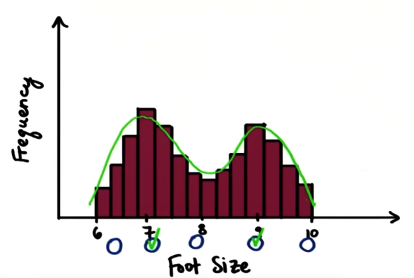

# Central Tendency

**Question:** How would you choose one number (or a small range of numbers) that accurately represents the typical salary of nursing or geography majors?

**ANS:**

* The value at which frequency is highest is called **Mode**

* Value in the middle of the distribution is called **Median**

* Average

## Mode

### Mode of Data set

**Question:** In given below list, what is the mode?
2  5  5  9  8  3
**ANS:** 5, as it is the repetitive value in the list

### Mode of Distribution

**Question:** What is the mode for below provided **frequency distribution**

**Ans:**
**Range** that occurred with the **highest** frequency. Because we can't see the **individual** values, but we can see which **bin** has the **highest** frequency.

### Mode - Negatively Skewed Distribution

**Question:** Where does the mode occur on below distribution

## Mode - Uniform Distribution

**Question:** Where does the mode occur on this distribution

|  | |
| --- | --- |
|||
| ||

**Ans:**
Some distribution like this one have no mode. This is called **Uniform Distribution**. However, some distributions have **multiple** modes.

### More than One Mode

**Distributions** are considered **multi-modal** when there are **two** or **more** distinct clear **trends**

**Question:** Where does the mode occur on this distribution

**ANS:**
**Data** tells a story. And in this case of foot size, there are **two modes**, here at `7` and `9`. Because a lot of **female** have size `7` foot, and a lot of males have size `9`, making this a **bi-modal distribution**.

### Mode of Categorical Data

The data doesn't need to be numeric to find a mode: we can also compute the **mode** for **categorical** data as well!

**Question:** Find the **mode** of a **categorical** data set: the preferred M&M flavor of 8,000 "UDACITY" students.

**Options:**

* Plain
* Peanut
* 1,000
* 7,000

**ANS:**

* Remember, the mode occurs on the **X-axis**, so you are looking for whatever value has the **highest** frequency.

* The numbers 7,000 and 1,000 are the actual frequencies. The mode, itself, is "Plain."

### Mode Quiz (True/False)

1. The mode can be used to describe any type of data we have, whether it's numerical or categorical. **True**
2. All scores in the data set affect the mode. **False**
**For Example:** 22, 54, 23, 22, 31, 17, 22, 1000 In either case mode will remain same **22**
3. If we take a lot of samples from the same population, the mode will be the same in each sample. **False**
**Note:** Because this third point is false, we can't really use **mode**to learn about our **population**. And this is our goa; in this course, **inferential statistics**. But still, the mode is important to take into account when describing a **data set**
4. There is an for the mode. **False**
**Note:** As we can not describe mode with an **equation**, this is why we often use **mean,** or **average**

## Mean/Average

### Definition

The mean of a data set is the numerical average and can be
computed by dividing the sum of all the data points by the number of data points:

**Note:** The mean is heavily affected by **outliers**, therefore we say the mean is **not** a **robust** measurement.

### Formula

**Population:**
A **population** is a collection of persons, objects or items of interest.

The **population mean** is represented by the Greek letter mu (μ). It is given by the formula

Where the capital Greek letter sigma (𝚺) is commonly used in mathematics to represent a summation of all the numbers in a grouping. _N_ is the number of terms in the population.

**Sample:**
A **sample** is a portion of the whole and, if properly taken, is representative of the whole.

The sample mean is represented by x bar . It is given by the formula.

Where _n_ is the number of terms in the sample.

|          | Nursing | Geography |
|   ----   |   ----  |    ----   |
|          | $58,350 |  $48,670  |
|          | $63,120 |  $57,320  |
|          | $44,640 |  $38,150  |
|          | $56,380 |  $41,290  |
|          | $72,250 |  $53,160  |
| **Mean** | $58,948 |  $47,718  |

### Properties of the Mean

* All scores in the distribution affect the mean.

* The mean can be described with a formula.

* Many samples from the same population will have similar means

* The mean of a sample can be used to make inferences about the population it came from.

* The mean will change if an extreme value becomes part of the data set. (Not a property odf mean)

**Inferences:** To derive as a conclusion from facts as premises

### Mean with Outlier

With the starting salaries of geography majors that you calculated before, what would be **new** mean if we added a person who has salary of **$500,000**?

|          | Nursing | Geography                    |
|   ----   |   ----  |    ----                      |
|          | $58,350 |  $48,670                     |
|          | $63,120 |  $57,320                     |
|          | $44,640 |  $38,150                     |
|          | $56,380 |  $41,290                     |
|          | $72,250 |  $53,160                     |
|          |         |  $500,000 &larr; **Outlier** |
| **Mean** | $58,948 |  $123,098                    |

Based on this data, would you tell that:

* This **average accurately** represents the salary of geography majors

* This average is misleading. (**✔**)
Because, if you look at data, all the other peoples are earning less than **$123,098**, in fact significantly less.

**Note:** The **average** or **mean** can be misleading when we have outliers.

**Outliers:**

* The values that are unexpectedly different from the other observed values.
* Outliers create skewed distributions by pulling the mean toward the outlier.
* This makes the mean a lot representative of the middle of the data.

**Note:**

* **Mode** does not influenced by an outlier.
* **Mean** mean is influenced a lot.
* We need some thing in between. This where median comes in, which is the middle of the data.

## Median

The median is the "**middle**" of the data; meaning half of the data values are **less** than the median, and half are **greater**.

**Question:** what do we have to do to make the median a useful statistic?

| Nursing | Geography |
|   ----  |    ----   |
| $58,350 |  $48,670  |
| $63,120 |  $57,320  |
| $44,640 |  $38,150  |
| $56,380 |  $41,290  |
| $72,250 |  $53,160  |

**Ans:** Put the data in order

|            |  Nursing  |  Geography  |
|    ---     |   ----    |    ----     |
|            |  $44,640  |   $38,150   |
|            |  $56,380  |   $41,290   |
|            |  $58,350  |   $48,670   |
|            |  $63,120  |   $53,160   |
|            |  $72,250  |   $57,320   |
| **Median** |  $58,350  |   $48,670   |

### Median with Outlier

Let's include the geography major, Michael Jordan, who make **$500,000** a year.

|            |  Nursing  |  Geography  |
|    ---     |   ----    |    ----     |
|            |  $44,640  |   $38,150   |
|            |  $56,380  |   $41,290   |
|            |  $58,350  |   $48,670   |
|            |  $63,120  |   $53,160   |
|            |  $72,250  |   $57,320   |
|            |           |   $500,000  |
| **Median** |  $58,350  |   $   |

**Question:** Where do you think the median is?

**Options:**

a. \$48,670
b. \$53,160
c. Anywhere in-between \$48,670 and \$53,160
d. Exactly in-between \$48,670 and \$53,160

**Ans:** d
(48,670 + 53,160)/2 = 50,915

**Note:** We always take the average of the two middle numbers when finding the median of data sets with an even number of scores

## Measures of Center (MEAN, MEDIAN, MODE)

* **Mean**, **Median** and **Mode**, these are all **measures of center** because they typically describe the **center** of the **distribution**.

* Sometime the **mean** does not describe the center because of an **outlier**. Sometimes, the mode does not describe the center. And the **median** does not take every **data point** into account.

* However, in below case, the median might have been a better statistic to determine what starting salary you would have made as a Geography major

**Note:** The **median** is always the best measure of central tendency when dealing with **highly skewed distributions**.

* What happened when we added outlier(\$500,000) into Geography data set?
  * The mean changed from \$47,718 to \$123,098.
  * The median only changed from \$48,670 to \$**50,915**
  **Note:** This **tendency** of median is called **robust**.
  **Robust:** In everyday language, robust means **strong** and **sturdy**, which make sense for statistical definition.

## Order Measures of Center

Measures of Center changes when we have different distributions.

**Question1:** For below positively skewed distribution, which do you think is true?  

a. mean < median < mode
b. median < mode  < mean
c. mode < median < mean
d. mode < mean < median

**Ans:** c

**Question2:** Which is true about below distribution

**Ans:** As you can see distribution is **symmetrical**. Therefore, the **mean** and the **median** will both occur pretty much right in the **center**.
This data uis **normal distributed**

### Use Measures of Center to

* Make good **decisions**
* Make **comparisons**. for example facebook friends

**Fun to know:** According to an article on [Mashable]('https://mashable.com/2011/11/17/facebook-stats/' "Who is an Average Facebook User?")  below are the fun facts about facebook users

### Formula for Location of Median

Describe the median value i symbols for any data set with n values.
Which formula(s) describe the median after sorting the data?

<u>**n even**</u>

<u>**n odd**</u>

### Wrap Up - Measures of Center - Intro to Descriptive Statistics

