# Standardizing

* We **visualize** data sets wit **histogram**, in order to analyze the shape, so that we can think critically about **mean**, **median** and **mode** to describe the data set.

* In **skewed distribution**  the mean, median and mode differ from each other. And the median might be more **useful** than mean in lot ways

* In **normal distribution**, the mean, median and mode are **approximately** equal.

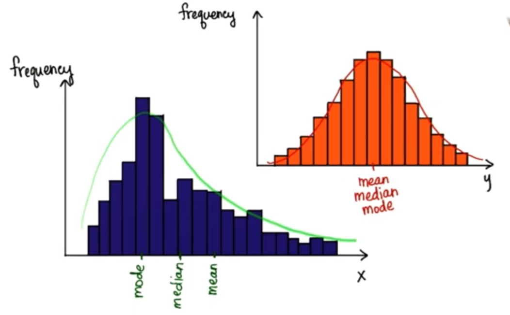

* **Question:1** What is important about knowing the shape of a distribution?
**Ans** To answer the above there is one more question.
  * **Question:1a** Which of these below gives you the best sense, of how good I am at Table Tennis? The purpose of this quiz, if you knew nothing about Table Tennis, what would be the best metric to tel you how good I am?
    1. My rating (1800)
    2. 8110th place among Pakistan competitive Table Tennis players.
    3. Ranked higher than 88% of  Pakistan Table Tennis Player

    **Ans:** Ranked higher than 88% of Pakistan competitive Table Tennis Player

  **Ans:1** The **percentage**(%) tells ua a lot. And that's why the shape of the **distribution** is even more important than simply figuring out whether the mean, median or mode are the best **metrics**

**Note:** What we are interested in throughout rest of this the course is the **proportion** of data values, less than or greater than a **certain** value in the data set.

So if I tell yo my rating is 1800, you really don't know what that means until I tell you the shape of the distribution of ratings. And you can see the proportion less.

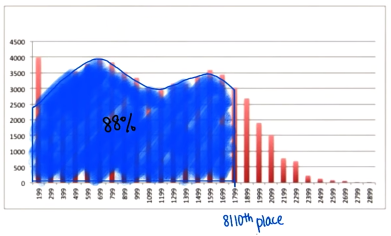

**Question:2** If we are concerned with the proportion less than or greater than a certain value on a distribution whta should we do?

  a. Use absolute frequencies
  b. Use relative frequencies

**Ans:2** Use **relative** frequencies, and **convert** all **absolute** frequencies to a **proportion**

## Relative Frequency Histogram

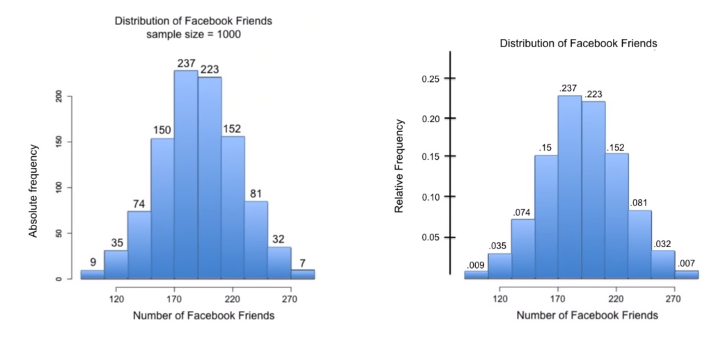
**Note:** You may see that relative frequency distribution looks almost exactly the same as the absolute distribution.

**Question:3** What proportion of values(number of facebook friends) are between `170` and `210`?

**Ans:3** 0.46 by adding the proportions `0.237` and `0.223`. These both lies between 170 and 210

**Question:4** What proportion of values(number of facebook friends) are between `180` and `200`?

**Ans:4** we can't tell for certain.

**Note:** _Remember_, a problem with histogram, that we have to **sacrifice** details for **convenience**. Because of these bins, we can't determine the **proportional** values less or greater than certain numbers.
We want to know things like this, though, to see certain scores compare to other scores in distribution. So what will allow us more detail?

**Ans:** A smaller bin size

**Note:** If we keep **decreasing** the bin size we loose the shape of our distribution

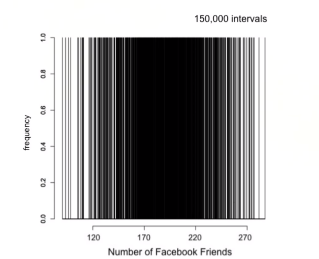

## Continuous Distribution

So we are in **predicament**. we want a **small** bin size to have as much **detail** as possible about the location of data values, relative to the rest of the distribution. But eventually, we start losing the shape of the distribution.

On other hand if we had a **large** bin size, than we  can't tell the **proportion** less than any data **value**.
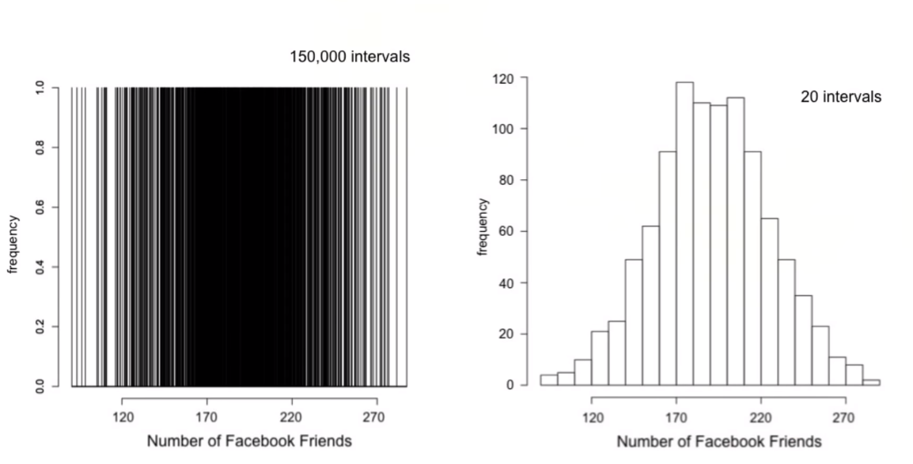

We are going to solve this **riddle** using a **theoretical model** our distributions. this model is smooth curve that uses **relative frequencies**.

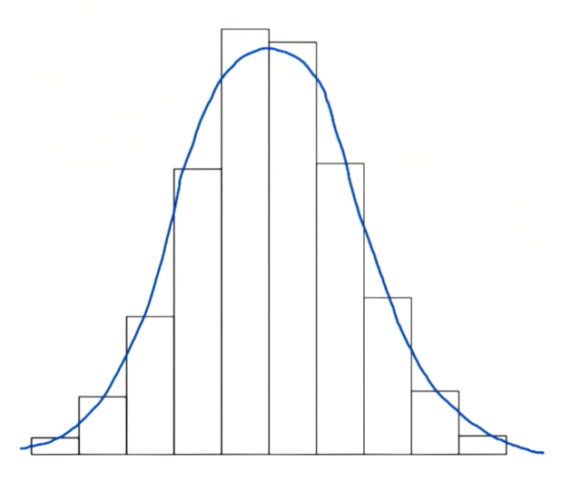
The above is a theoretically continuous distribution that can be described with an **equation**. this allow us to calculate the proportion **between** any two **values** on the x-axis

**Question:5** What will be the area under above curve? **Note:** Just remember that we a histogram, what did all the relative frequencies add to?

**Ans:5** 1.0, it is the sum of all frequencies in all the bins.

## Theoretical Normal Distribution

There are many types of normal distribution

a. Stretched
b. Skinny
c. etc.

* But the area **underneath** will always be 1 or 100%. And mean, median and mode are exactly equal.
* Theoretical model is perfectly symmetrical. This doesn't usually happen in real life. These models approximate our real distributions.
* In our theoretical model, most of the data is in middle clustered around mean, median and mode. From last lesson we can recall that approximately 68% lie within 1 standard deviation of the mean. And 95% fall within 2 standard deviation of the mean.

|||
| ---- | ---- |
| 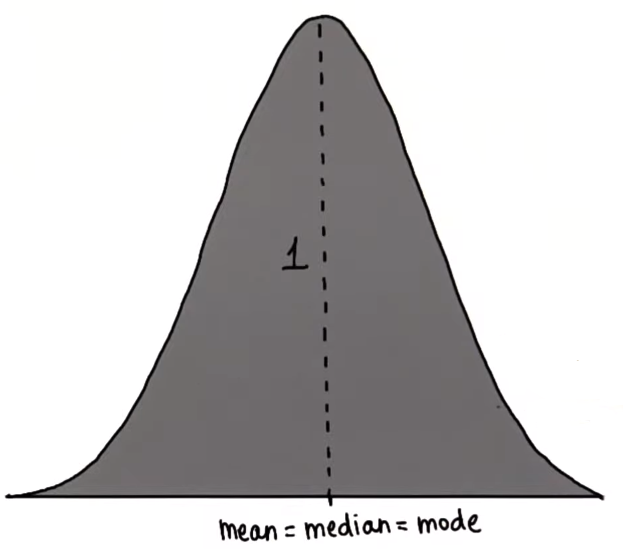 | 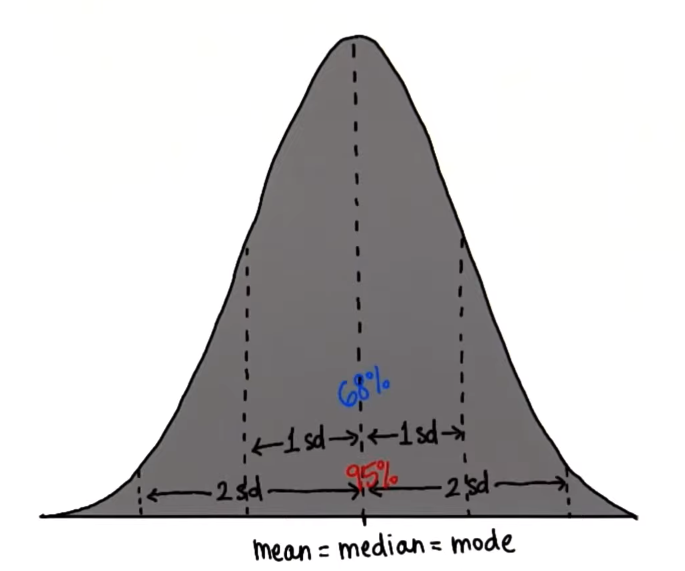  |

## Standard Score / Z-Score

* The location of particular values on X axis is often described in terms of standard deviation
* Given an observed value x, the Z score finds the number
of Standard deviations x is away from the mean.
* What ever score we might have, we can convert it to a values equal to the number of **standard deviation** away from the **mean**. This is call **z**.
  * z = number of standard deviations away from the mean.
* By converting scores in a normal distribution to this special number z. We can know percent less than or greater than that value

|||
| ---- | ---- |
| 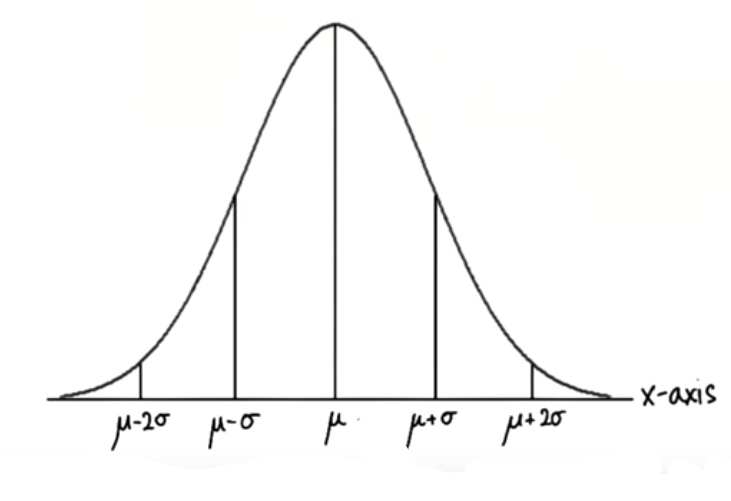 | 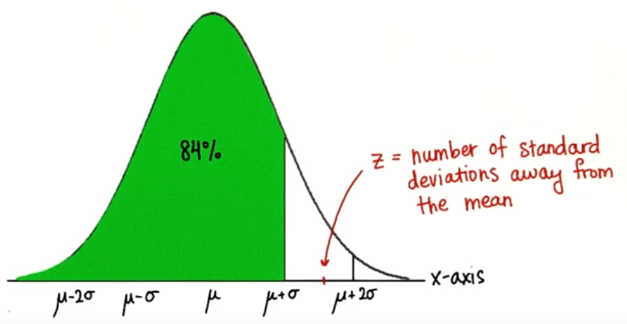  |

### Popularity

A better way to look at **popularity**, to look at the **distributions**.
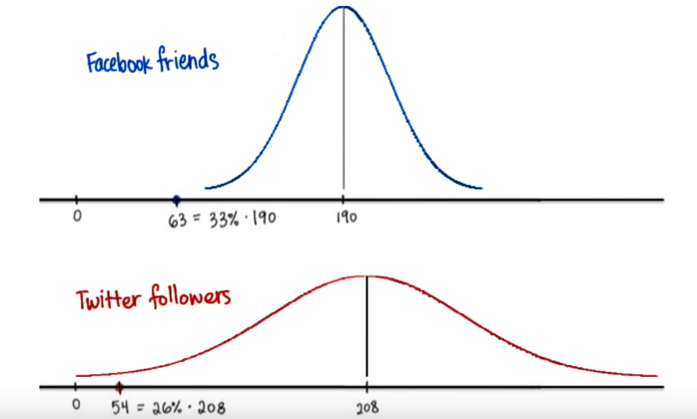

* Both of the distributions are **normal**
* The standard deviation of Twitter followers is `60`, but the standard deviation of Facebook friends is only '35'.
* So, the number of standard deviation **away** from the mean is definitely a better way to look at **unpopularity**.

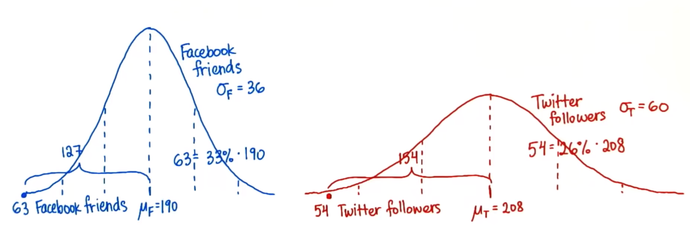

**Question:6** Ans the below two questions

**Question:6a** How many standard deviations is Katie's number of Facebook friends from the mean number of  Facebook friends?

**Ans:6a**  
(Mean -  Katie's number of Facebook friends)/ Standard Deviation
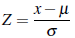
3.52

**Question:6b** How many standard deviations is Andy's number of Twitter friends from the mean number of Twitter friends?

**Ans:6b**
(Mean -  Andy's number of Twitter friends)/ Standard Deviation

2.57

**Question:7** If Andy only uses Twitter and Katie only use Facebook, Can we necessarily say that Andy is more unpopular than Katie?

**Ans:**

* No, because look at the distributions, they are both different.
* And we can **compare** them by looking at on the **same scale**. In other words ,in terms of their **unique** standard deviations. This is called **standardizing** the distributions, using `0` as our reference point
* When we **standardize** Andy's and Katie's individual scores, Katie's is further from the mean
* The standardize scores show us the **proportion** that have a **lower** or **higher** score in **that** distribution.
* In the distribution of Facebook friends, there is a **greater** proportion of people with more friends than Katie, than the proportion of people with more Twitter followers than Andy.
* So **Katie** is more unpopular.

### Negative Z-Score

**Question:8** What does a negative Z-Scores mean?

**Ans:**

* The original value is less than the mean.
* The original value minus the mean is negative

### Mean of Standardized Distribution

**Question:9** If we standardize a distribution by converting  every value to a **z-score**, what will be the new **mean** of this standardized distribution?

**Ans:** Mean = 0

* If we standardize a distribution by converting  every value to a z-score, actually we are shifting it all the way over to zero because we are subtracting the mean.
**Example:** If we have a normal distribution out here with mean of`100`, if we subtract the mean, we shift this distribution to the left `100`. And then, the new mean is `0`.
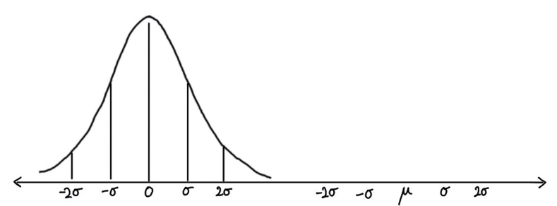

* What if we add a distribution with mean of negative 30? If we subtract negative 30, then we're essentially adding 30. And distribution to the right, again, centering at 0.
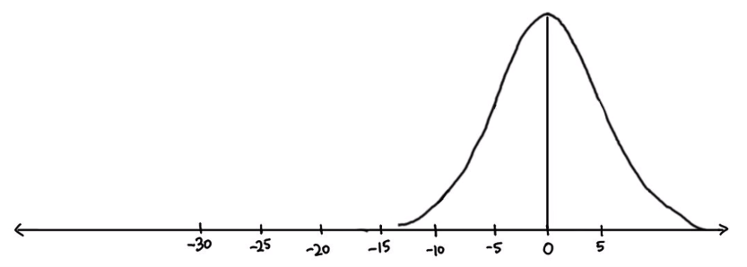

### SD of Standardized Distribution

**Question:10** If we standardize a distribution by converting  every value to a **z-score**, what will be the new **standard deviation** of this standardized distribution?

**Ans:** When we calculate **z-score** of any value in distribution, we first subtract the **mean** which **shifts** the distribution without changing the shape so that zero is now mean And when we divide by standard deviation, we then change the shape.
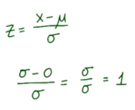
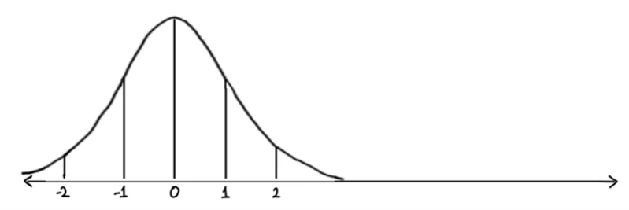

## Standard Normal Distribution

when we have **normal distribution**, we can standardized it by first subtracting the **mean**, shifting it to `0`. And then dividing by **standard deviation**, which makes the standard deviation `1`. This is called the **Standard Normal Distribution**.

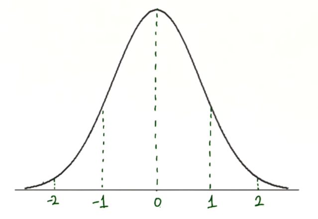

### Quizzes (22 - 23 All are interlinked)  

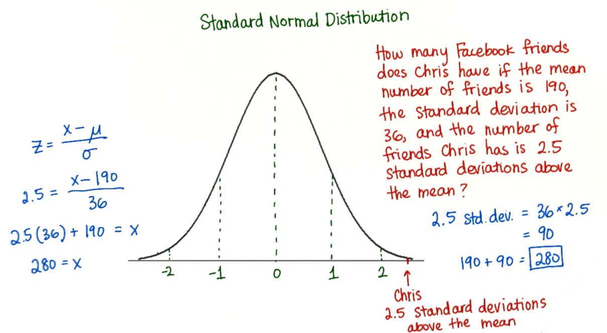

**Note:**

* We can create any **normal distribution** with any **normal distribution**. Basically we can take any normal distribution, convert it to the **standard normal distribution** and then **scale** it any way we want.

**Example:**
Let say we want to give every one a popularity score from `0` to a `100` with `50` being the **mean**. And let's say we want the **standard deviation** to be `10`.
We start with our original Facebook Distribution where:

Mean = 190
Standard Deviation = 36
Number of FB Friends = 210

z = (x - Mean) / (Standard Deviation)
z =  (210 -190)/36
z = 0.56

Now we want to convert the above **z-score** to  a new popularity score with with:

Mean = 50
Standard Deviation = 10
x = ?
z =  0.56

x = (z*Standard Deviation) + 50
x =  55.6

Will write the details later for future reference.
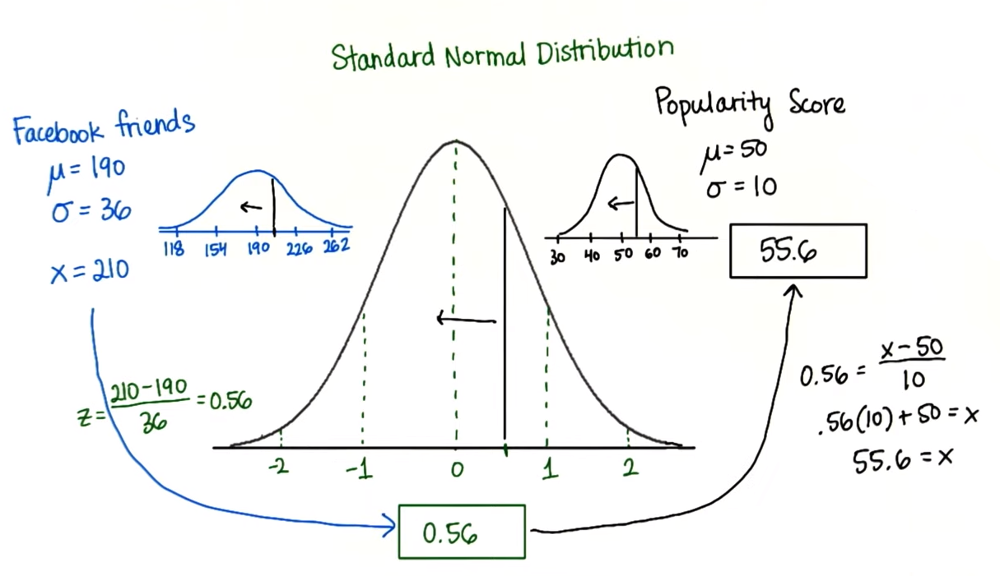

### Some more Facts

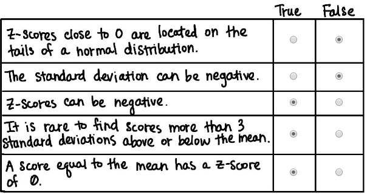
