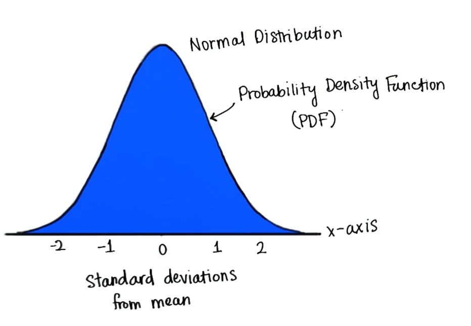

# Normal Distribution

## Probability Distribution Function

### Intro

You have seen the **normal distribution**,by knowing the where on the **x-axis** the value **falls**, in terms of **standard deviation**, we can determine the percentage **less than** or **greater than** any value.

In this lesson you are going to calculate these percentages. Remember we used theoretical **curve** to model the data and area under this curve is **one**, that's because it models with **relative frequency** of a distribution of data in terms of proportion. This  **curve** is called the **Probability Density Function** (PDF).

#### Why it is called PDF

